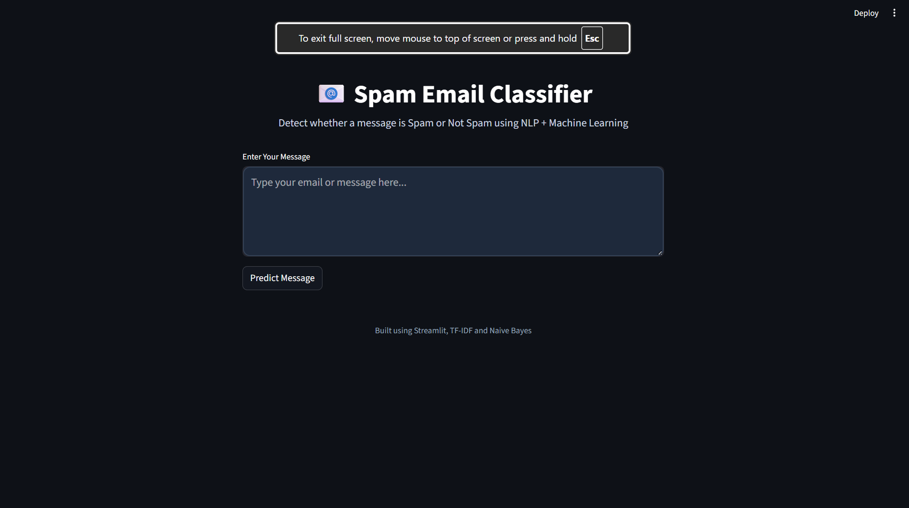
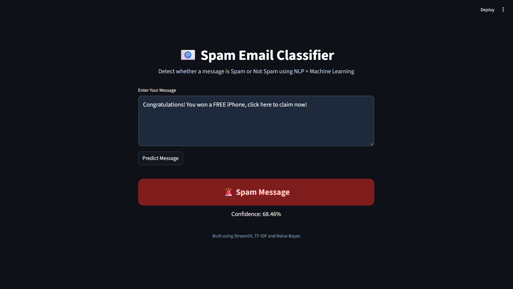
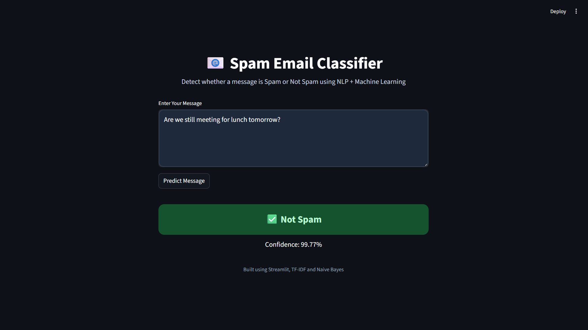

# 📧 Spam Email Classifier using NLP

A Machine Learning + NLP based Spam Email Classifier built using **TF-IDF Vectorization** and **Multinomial Naive Bayes** with a modern **Streamlit UI**.

---

# 🚀 Features

- Detect Spam and Not Spam messages
- NLP text preprocessing
- TF-IDF Vectorization
- Naive Bayes Classification
- Confidence Score Prediction
- Interactive Streamlit Web App
- Real-time message prediction

---

# 🛠 Technologies Used

- Python
- Pandas
- NumPy
- Scikit-learn
- NLTK
- Streamlit
- Joblib

---

# 📂 Project Structure

```bash
Email Spam Detector/
│
├── Dataset/
│   └── spam.csv
│
├── models/
│   ├── spam_model.pkl
│   └── vectorizer.pkl
│
├── app.py
├── train.py
├── predict.py
├── requirements.txt
├── README.md
└── .gitignore
```

---

# 🧠 Machine Learning Workflow

```text
Dataset
   ↓
Text Preprocessing
   ↓
TF-IDF Vectorization
   ↓
Train/Test Split
   ↓
Naive Bayes Training
   ↓
Prediction
   ↓
Streamlit UI
```

---

# 🧹 NLP Preprocessing Steps

- Convert text to lowercase
- Remove URLs
- Remove HTML tags
- Remove punctuation
- Remove extra spaces

---

# 📊 Algorithm Used

## TF-IDF Vectorizer

Converts text data into numerical vectors.

## Multinomial Naive Bayes

Used for text classification and spam detection.

---

# 🎯 Model Accuracy

```text
Accuracy: 96.77%
```

---

# 💻 Streamlit UI

The project includes a modern Streamlit web interface for real-time spam detection.

---

# ▶️ How to Run Project

## 1️⃣ Clone Repository

```bash
git clone https://github.com/mohit8490/spam-email-classifier.git
```

---

## 2️⃣ Go to Project Folder

```bash
cd spam-email-classifier
```

---

## 3️⃣ Install Required Libraries

```bash
pip install -r requirements.txt
```

---

## 4️⃣ Run Streamlit App

```bash
streamlit run app.py
```

---

# 📌 Example Predictions

## Spam Message

```text
Congratulations! You won free recharge.
```

Output:

```text
Spam Message
```

---

## Normal Message

```text
Hey bro, let's meet tomorrow.
```

Output:

```text
Not Spam
```

---

# 📸 Screenshots

## Home Page



---

## Spam Prediction



---

## Not Spam Prediction




---

# 🔮 Future Improvements

- Add Deep Learning Models
- Use BERT Transformer
- Email File Upload Support
- Multi-language Spam Detection
- Deploy Online

---

# 👨‍💻 Author

Mohit Choudhary

---

# ⭐ If you like this project

Give this repository a star on GitHub ⭐